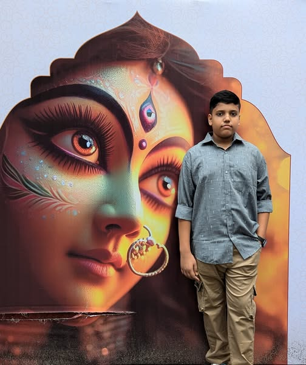

<body style="color: white;">

<div align="center">

# 👋 Rishan Koiry

<a href="https://rishankoiry.vercel.app/">
  
</a>
<div style="text-align: center; margin-top: 30px;">
  <a href="https://git.io/typing-svg" style="display: inline-block; box-shadow: 0 15px 30px rgba(0, 0, 0, 0.3);">
    
  </a>
</div>

</div>

## 🚀 About Me

```python
class RishanKoiry:
    def __init__(self):
        self.name = "Rishan Koiry"
        self.role = "Django & Python Developer"
        self.skills = ["Python", "Django", "HTML", "CSS"]
        self.current_project = "Building E-Commerce Platform with Django"
        self.goal_2025 = "Contribute to 5+ open source projects"

    def daily_routine(self):
        return ["☕ Coffee", "💻 Code", "🐞 Debug", "🔄 Repeat"]
```

- 🔭 Working on **Django-powered web applications**
- 🌱 Currently learning **Advanced Python & Django**
- 👯 Looking to collaborate on **open-source projects**
- 💡 Exploring **Flask Development**
- ⚡ Fun fact: **I code better with lofi beats 🎷**

## 🛠️ Tech Stack

<div align="center">
  
</div>

## 📊 GitHub Stats

<br>
<div align="center">
  
</div>

## 🏆 Achievements

- ⭐ Contributed to **5+ Open Source** Django projects
- 🚀 Deployed high-performance **Django apps** with 99.9% uptime
- 🔥 Optimized database queries for **50% faster response times**
- 🏅 Implemented **CI/CD pipelines** for automated deployment
- 🔒 Secured **Django applications** with industry best practices
- 🔍 Enhanced **SEO & Performance** for Django web apps
- 💎 Earned multiple **developer certifications**
- 🎉 Featured in **tech communities & blogs**

## 🎯 Current Focus

<div align="center">
  <table>
    <tr>
      <td align="center" width="33%">
        
      </td>
     
  </table>
</div>

## 🏆 Trophy Cabinet

<div align="center">
  
</div>

## 📫 Connect With Me

<div align="center">
  <a href="https://www.youtube.com/@Rishankoiry" target="_blank">
    
  </a>
  <a href="mailto:rishankoiry@gmail.com" target="_blank">
    
  </a>
  <a href="https://rishankoiry.vercel.app" target="_blank">
    
  </a>
</div>

---

<div align="center">
  
### 🎉 Thanks for visiting! Let's build something awesome together! 🚀


</div>
</body>
